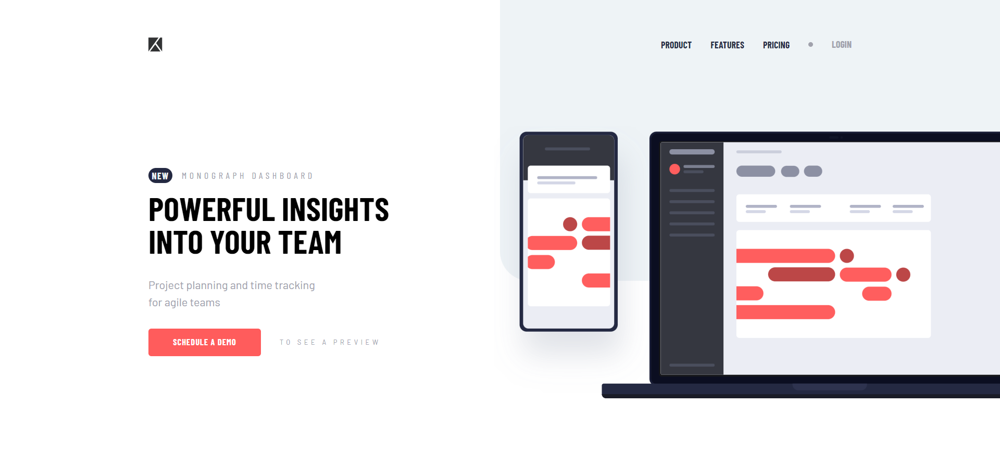

# Frontend Mentor - Project tracking intro component solution

This is a solution to the [Project tracking intro component challenge on Frontend Mentor](https://www.frontendmentor.io/challenges/project-tracking-intro-component-5d289097500fcb331a67d80e). Frontend Mentor challenges help you improve your coding skills by building realistic projects. 

## Table of contents

- [Overview](#overview)
  - [The challenge](#the-challenge)
  - [Screenshot](#screenshot)
  - [Links](#links)
- [My process](#my-process)
  - [Built with](#built-with)
  - [What I learned](#what-i-learned)
  - [Continued development](#continued-development)
- [Author](#author)

## Overview

### The challenge

Users should be able to:

- View the optimal layout for the site depending on their device's screen size
- See hover states for all interactive elements on the page
- Create the background shape using code

### Screenshot



### Links

- Solution URL: [Github repo](https://github.com/Robertron624/newsletter-sign-up-with-success-message)
- Live Site URL: [Add live site URL here](https://your-live-site-url.com)

## My process

### Built with

- Semantic HTML5 markup
- CSS custom properties
- Flexbox
- CSS Grid
- Mobile-first workflow
- JavaScript - event handling

### What I learned

With this project I kept learning event handling with plain JavaScript and kept improving my layout skills, also I got confortable with the use of the dialog element for the mobile menu.

```js
window.addEventListener("click", (e) => {
    if (e.target == mobileMenuModal) {
        mobileMenuModal.close();
        hamburgerMenu.src = "/images/icon-hamburger.svg";
        isMobileMenuOpen = false;
    }
});
```

### Continued development

I want to keep using plain JavaScript for event handling and keep improving my layout skills, also I want to keep learning more about the use of the dialog element for projects that require a modal since using this element is a lot easier than using other elements and CSS to achieve the same result.

## Author

- Personal Website - [Robert Ramirez](https://robert-ramirez.netlify.app)
- Frontend Mentor User- [@Robertron624](https://www.frontendmentor.io/profile/Robertron624)
- Twitter - [@robertdowny](https://www.twitter.com/robertdowny)
